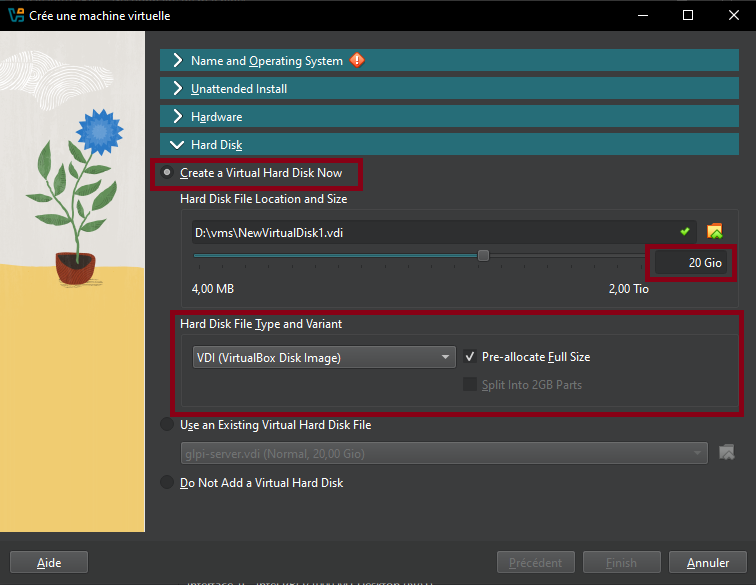

# Set up a LAMP server

Prerequisites: Type 2 hypervisor. In this guide, we're going to use VirtualBox (but you can always use virt-manager on Linux).

### Configuring a Debian VM: 

- Downloading Debian on www.debian.org (this will be the operating system on which will run the virtual machine. 
- Download, install and configure VirtualBox and VirtualBox Extension Pack 
- For VirtualBox: accept everything and proceed.

 

 - For VirtualBox Extensions Pack:
  1. Open the downloaded file 
  2. Click on Installation 
  3. Accept the terms of service 
  4. Tools → Extensions hamburger menu to check that the extension is installed.

---

- Creation of the Debian Virtual Machine: 

 

- Choose an appropriate name for the VM 
- Choose the Debian ISO image you downloaded earlier 
- Check "Skip Unattended Installation" 



- Resources to be assigned: 2048MB of RAM, 1-2 CPUs and 10-20GB of hard drive.
- Click "Finish", and you should see the machine appear in the VM list if there are no problems.

---

### Additional Configurations:

- Enable shared clipboard and drag and drop in General → Advanced

 

- Enable shared folders in Settings → Shared Folders (here I added a
scripts folder)

 

In the "System" tab, change the boot order to:
- Hard Drive (Checked)
- Optical Drive (Checked)
- Floppy Drive (Unchecked)
- Network Drive (Unchecked)


- In the "Display" tab → Screen, increase the "Video Memory" slider to 128MB and check the "Enable 3D Acceleration" box.
- In the "Network" tab, check that the "Enable Network Interface" and "Cable Connected" boxes are enabled. The network access mode must also be set to "NAT".
- In the "USB" tab, enable the USB controller and check the "USB 3.0 Controller (xHCI)" button.

--- 

### You may finally boot up the Debian Virtual Machine.


- Partition formatting: Yes.
- At the taskbar step, Debian will ask you to choose which software to pre-install. You must check "SSH Server," leave "Common System Utilities" checked, and check "XFCE Desktop", or a different one of your convenience.
- Install the GRUB boot program: Yes, and select the disk that appears.


VirtualBox Guest Additions:
- In the menu bar, click "Devices", then "Insert Guest Additions CD Image".
- Access the optical drive that just appeared.
- Right-click → open a terminal.
- Become root by running the su command and entering your password.
- Enter the command sh ./VboxLinuxAdditions.run to start the installation of the "Guest Additions".
- Restart the VM.
- Make sure that in the "Devices" menu, "Shared Clipboard" and "Drag & Drop" are checked to "Bidirectional".
- Right Ctrl + f: to enable/disable full screen.

--- 

### GLPI Installation

- Once Debian is installed, create a Bash script called setup_glpi.sh that will set up
the LAMP stack. This script requires root access.
- The LAMP stack consists of the Apache2 web server, a MariaDB database and the PHP language.
- If "sudo" doesn't work for some reason, you can use "su" instead for the time being. In my situation, I had to install it manually from apt and grant my own user to the sudo group.

```bash
#!/usr/bin/env bash
# setup_glpi.sh
set -e
# before running the script, make sure to do chmod +x setup_glpi.sh
# this script needs root permissions. run it with sudo ./setup_glpi.sh
echo "Updating and upgrading..."
apt update && apt upgrade -y

echo "Installing Apache..."
apt install apache2 -y

echo "Installing MariaDB..."
apt install mariadb-server -y

echo "Securing MariaDB..."
mysql_secure_installation

echo "Installing PHP + extensions..."
apt install php php-mysql php-xml php-mbstring php-curl php-gd php-ldap php-imap php-zip php-intl libapache2-mod-php -y
echo "Restarting Apache..."
systemctl restart apache2
```

- Connect to the MariaDB database to create a database and user for GLPI

```bash
sudo mysql -u root -p
```

```sql
# In the MySQL shell:
CREATE DATABASE glpidb;
CREATE USER 'glpiuser'@'localhost' IDENTIFIED BY 'pwatpwat';
GRANT ALL PRIVILEGES ON glpidb.* TO 'glpiuser'@'localhost';
FLUSH PRIVILEGES;
EXIT;
```

- Download and deploy GLPI to the virtual machine

```bash
cd /tmp
wget https://github.com/glpi-project/glpi/releases/download/10.0.13/glpi-
10.0.13.tgz
tar -xvzf glpi-10.0.13.tgz

# Move it to web root
sudo mv glpi /var/www/html/

# Set permissions
sudo chown -R www-data:www-data /var/www/html/glpi
sudo chmod -R 755 /var/www/html/glpi

# Enable Apache mod_rewrite just in case
sudo a2enmod rewrite
sudo systemctl restart apache2
```

- Open your web browser
- Type `ip a | grep inet` in the terminal to find the machine's IP address
- Enter this IP address in your browser, and you should see the default Apache 2 page.
- Append /glpi to the address, and you should see the GLPI installation page.

Problems that may arise during installation:
- If you forgot a PHP extension, the installer will error out. You will need to find it and install it in the terminal (`apt install php-xxx`) and then restart the Apache 2 server (`systemctl restart apache2`).

Some example GLPI configuration:

```
GLPI Database:
Server: localhost
User: glpiuser
Password: pwatpwat
Use an existing database: glpidb
```

The default usernames and passwords are:
- glpi/glpi for the administrator account
- tech/tech for the technician account
- normal/normal for the normal account
- post-only/postonly for the postonly account


You can delete or modify these accounts as well as the initial data. And with that, the GLPI server has been successfully installed!


Once you are able to see a result similar to this screenshot, it is safe to remove the GLPI installation file with:

```bash
rm /var/www/html/glpi/install/install.php
```

---

### Connect to GLPI from a computer on the same network

- From the VM, type `ip a` to find the IP address to connect to.
- Since NAT is used for the VM, in VirtualBox you will need to go to VM →
Configuration → Network → Adapter 1 → Port Forwarding.
- Add a rule:
  ``` 
  Name: HTTP
  Protocol: TCP
  Host IP (leave blank)
  Host port: 8080
  Guest IP (leave blank)
  Guest port: 80
  ```

- Then, on the host machine, access the address: http://localhost:8080/glpi
- If all goes well, you have successfully connected to your VM's Apache server from the host machine. Log in with the Technician account, for example.


---

### Create a snapshot

It's important to create snapshots regularly in case of mishandling.
- Click the VM's hamburger menu
- Snapshots
- Click "Take" and add a title and description.

